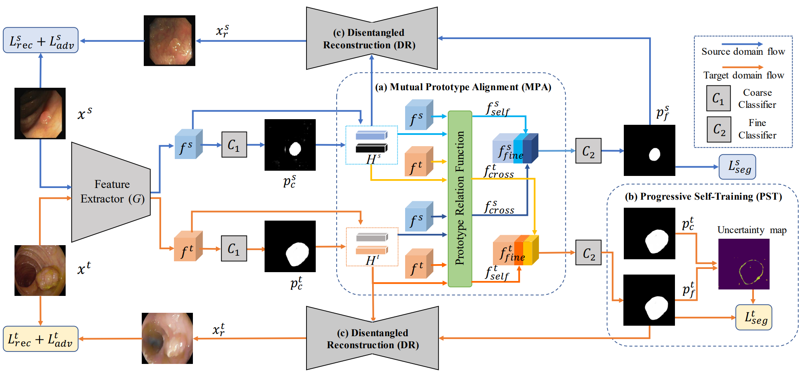

# Mutual-Prototype Adaptation for Cross-Domain Polyp Segmentation (JBHI 2021)


This is the official PyTorch implementation of **MPA** (Mutual-Prototype Adaptation) (JBHI 2021). [paper](https://ieeexplore.ieee.org/stamp/stamp.jsp?tp=&arnumber=9423517) from JBHI 2021.


## Dependencies
* python 3.7
* pytorch >= 1.5.0
* numpy
* pillow

## Data
You can download all datasets used in the paper from [here](https://1drv.ms/u/s!AtBnuAhBSAqjdjpLjYOq_geB1f4?e=zChYcN). 
## Quickstart
```
python ./tools/train.py
```

## Cite
If you find our work useful in your research or publication, please cite our work:
```
@article{yang2021mutual,
  title={Mutual-Prototype Adaptation for Cross-Domain Polyp Segmentation},
  author={Yang, Chen and Guo, Xiaoqing and Zhu, Meilu and Ibragimov, Bulat and Yuan, Yixuan},
  journal={IEEE Journal of Biomedical and Health Informatics},
  year={2021},
  publisher={IEEE}
}
```
